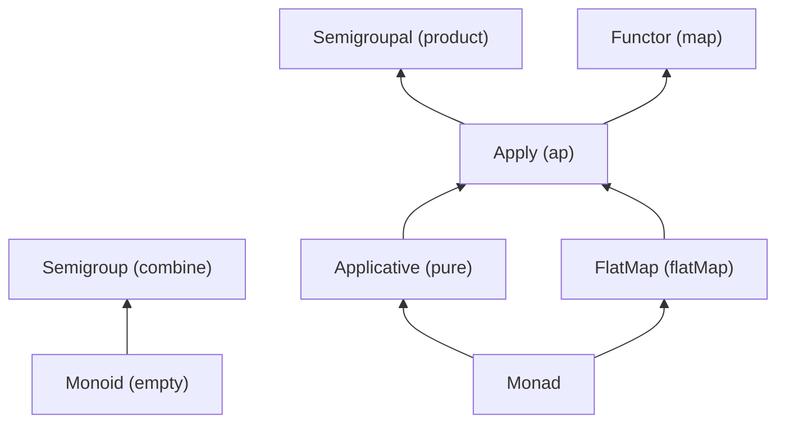

# Lamda

Lamda is a minimal functional programming library for Scala.

## Getting Lamda
Lamda is not a published project. If you want to use the library,
you should clone the project and publish it locally as on the following command:
```bash
# on interactive sbt shell
sbt:lamda> publishLocal

# on bash
$ sbt publishLocal
```

Then you can add the library in the library dependencies as others.
```scala
libraryDependencies += "csgn" %% "lamda-core" % "1.0.0-SNAPSHOT"
```

## Run Tests
You can run all tests as on the following command:
```bash
# on interactive sbt shell
sbt:lamda> tests/test

# on bash
$ sbt tests/test
```

If you want to run specific test:
```bash
# on interactive sbt shell
sbt:lamda> tests/testOnly *FunctorSuite

# on bash
$ sbt "tests/testOnly *FunctorSuite"
```

## Quick Start
```scala
import lamda._                      // will import all typeclasses
import lamda.Functor                // will import Functor typeclass
import lamda.syntax.all._           // will import all ops
import lamda.syntax.functor._       // will import Functor's ops
import lamda.instances.all._        // will import all instances
import lamda.instances.list._       // will import list's instances
import lamda.implicits._            // will import all ops and instances
```

```scala
import lamda._
import lamda.implicits._

scala> List(1, 2, 3).fmap(_ * 2)
res0: List[Int] = List(2, 4, 6)

scala> Monoid[Option[Int]].combine(Some(1), Some(2))
res1: Option[Int] = Some(3)

scala> Apply[Option].productR(Some(1), Some(2))
res2: Option[Int] = Some(2)

scala> Some(1) <* Some(2)
res3: Option[Int] = Some(1)
```


## Type classes


# License
```
MIT License

Copyright (c) 2024 csgn

Permission is hereby granted, free of charge, to any person obtaining a copy
of this software and associated documentation files (the "Software"), to deal
in the Software without restriction, including without limitation the rights
to use, copy, modify, merge, publish, distribute, sublicense, and/or sell
copies of the Software, and to permit persons to whom the Software is
furnished to do so, subject to the following conditions:

The above copyright notice and this permission notice shall be included in all
copies or substantial portions of the Software.

THE SOFTWARE IS PROVIDED "AS IS", WITHOUT WARRANTY OF ANY KIND, EXPRESS OR
IMPLIED, INCLUDING BUT NOT LIMITED TO THE WARRANTIES OF MERCHANTABILITY,
FITNESS FOR A PARTICULAR PURPOSE AND NONINFRINGEMENT. IN NO EVENT SHALL THE
AUTHORS OR COPYRIGHT HOLDERS BE LIABLE FOR ANY CLAIM, DAMAGES OR OTHER
LIABILITY, WHETHER IN AN ACTION OF CONTRACT, TORT OR OTHERWISE, ARISING FROM,
OUT OF OR IN CONNECTION WITH THE SOFTWARE OR THE USE OR OTHER DEALINGS IN THE
SOFTWARE.

```
